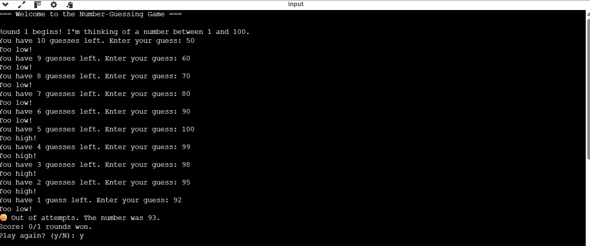
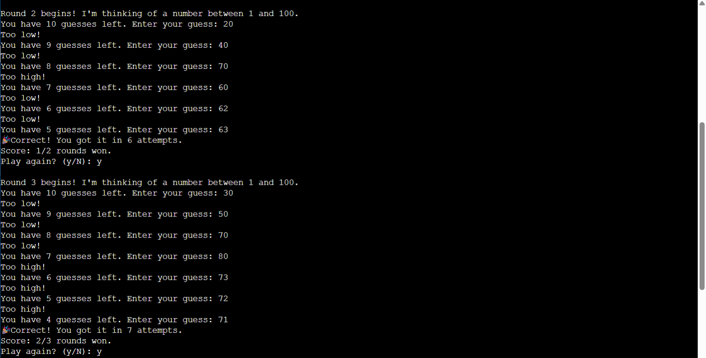
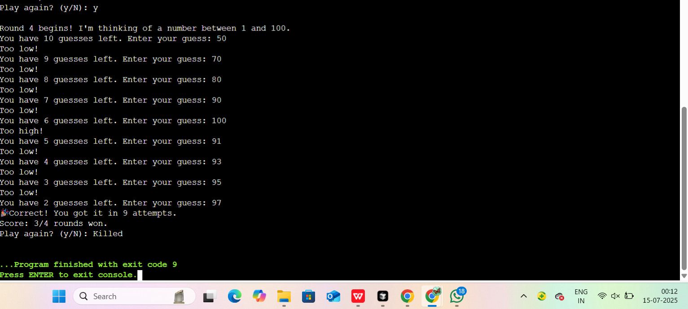

# 🎮 Mini Java Projects

This repository contains simple Java console-based projects to improve logic building and core programming skills.

---
## ✅ Task 1: Number Guessing Game

A guessing game where the player must find a number between 1 and 100 within a limited number of tries.

### Features:
- Random number generation
- Attempt limit (default: 10)
- High/Low feedback
- Score tracking and replay option
### Outputs :



### Run:
```bash
javac NumberGuessGame.java
java NumberGuessGame


